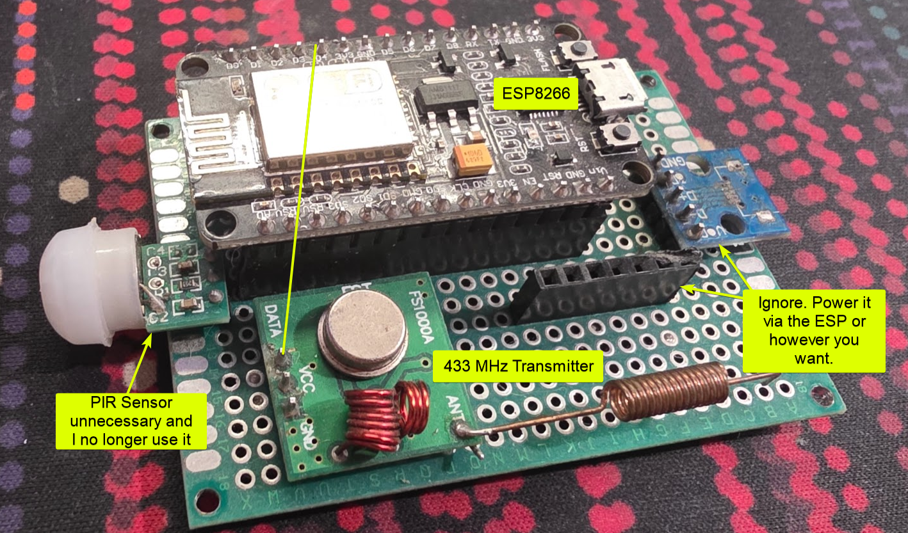
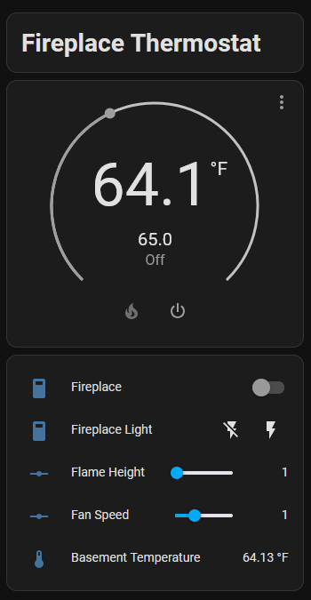

# ESPHome Setup
I made this five years ago and I don't recall all the bits to make this work. Please submit a PR if you implement this. Someone with a fresh experience should be able to make more sense out of what is/isn't required to get this setup.

## Hardware
Make an ESP32 or ESP8266 based device with a 433MHz transmitter. The only important part here is the connection from the ESP GPIO to the 433MHz transmitter.

## ESPHome Config
See [esphome.yaml](./esphome.yaml) for a version of yaml similar to what I use for this module. I do not recall off hand how custom_component in ESPHome works. I now see custom_component is replaced by external components. I do not know how that will work with this and I don't plan to change this now. Please submit a PR if you figure that part out. That'd be great.

Note: This requires an MQTT server setup in this device's ESPHome yaml as well as setup in Home Assistant.

## Home Assistant Config
See [ha-configuration.yaml](./ha-configuration.yaml) for the code I could find in my setup. Again this was five years ago so I don't recall all relevant details on how I made this work but this seems like most of it.

Note: I do use an external temperature sensor not included on my RF transmitter that's hooked into Home Assistant on its own completely separate from this project.

This is what it looks like in my current Home Assistant UI when setup as a climate object in addition I've broken out some of the other functions to edit manually.

